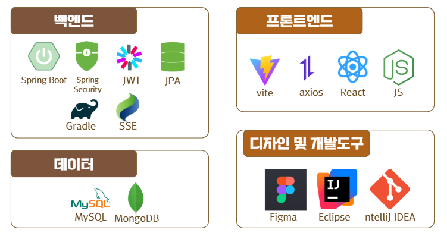
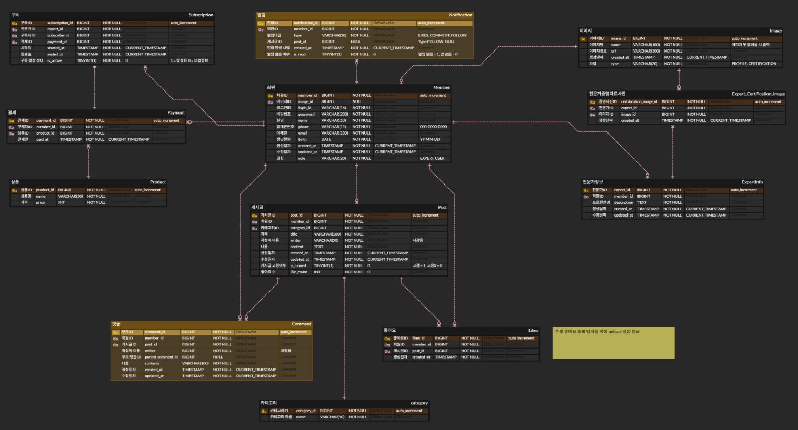

<p align="center">
  
</p>
<br>

## 📌 제작 목표
- 심리학 전문가들의 짧고 깊이있는 인사이트를 공유함으로써 검증된 심리학 정보를 전달합니다.  
- 사용자는 관심 있는 전문가를 구독함으로써 꾸준히 콘텐츠를 받아볼 수 있습니다.  
- 글을 작성하는 심리학 전문가는 크리에이터로서 지식 콘텐츠를 유료로 수익화할 수 있는 구조를 제공합니다.  
- 이용자는 단순 피드 소비를 넘어 구독을 통한 깊이 있는 정보 접근이 가능하도록 설계합니다.
<br><br>

## 📌 개발 역할
| 기능 영역         | 주요 기능 요약                                                         | 담당자         |
|------------------|------------------------------------------------------------------------|----------------|
| 회원 기능         | - 회원가입<br>- 로그인/로그아웃<br>- 개인정보 수정                     | 김상윤         |
| 프로필 기능       | - 전문가 등록<br>- 팔로우/구독 리스트                                  | 신드보라       |
| 게시글 기능       | - 피드 작성/조회/수정<br>- 카테고리별 조회<br>- 프로필           | 김현민         |
| 댓글 기능         | - 댓글/대댓글 작성<br>- 수정/삭제                                      | 김송이         |
| 구독(결제) 기능   | - 결제<br>- 구독 관리<br>- 구독자 리스트<br> - 검색                                 | 권혁준         |
| 알림(SSE) 기능    | - 좋아요/댓글 알림<br>- 알림 기록 저장                                 | 최이화         |
<br><br>

## 📌 Git 활용 전략

### ● Branch 전략
- `main` : 실제 배포용 브랜치  
- `develop` : 기능 개발 완료 통합 브랜치  
- `feature` : 개별 기능 단위로 생성되는 브랜치

### ● Pull Request
- 개발 반영 내용 명시  
- 리뷰 포인트 작성  
- PR을 통한 상호간 코드 리뷰

---

### 1. Branch Strategy

```
main              # 실제 배포용 브랜치
 └─ develop       # 기능 개발 완료 통합 브랜치
     └─ feat/기능명  # 개별 기능 단위로 생성되는 브랜치
```

---

### 2. Commit Message

```
<type>: <description>

[optional body]
```

---

### 3. Commit Type

| type     | 설명                 |
|----------|----------------------|
| feat     | 기능 개발            |
| fix      | 오류 수정            |
| refactor | 기능변경 없는 코드 수정 |
| env      | 초기 환경 설정       |
<br><br>

## 📌 기술 스택
<details>
<summary>기술스택 정리</summary>

- **백엔드**  
Spring Boot, Spring Security, JWT, JPA, Gradle, SSE

- **프론트엔드**  
Vite, Axios, React, JavaScript

- **데이터**  
MySQL, MongoDB

- **디자인 및 개발도구**  
Figma, Eclipse, IntelliJ IDEA 

</details>

<p align="center">
  
</p>
<br><br>

## 📌 주요 기능

- JWT 기반 회원가입 / 로그인 / 로그아웃  
- 피드 CRUD 및 카테고리 별 게시글 필터링  
- 전문가 소개 및 구독 버튼 제공  
- 전문가 이름 기반 검색 및 구독 여부 표시  
- 댓글 및 대댓글 작성, 수정 및 삭제  
- 구독 목록을 통해 사용자가 구독한 전문가 확인  
- 전문가 구독 기능 및 결제 처리, 결제 기록 조회  
- 좋아요 및 댓글 활동, 구독 소식에 대한 실시간 알림을 제공  
<br><br>

## 📌 ERD
<p align="center">
  
</p>
<br><br>